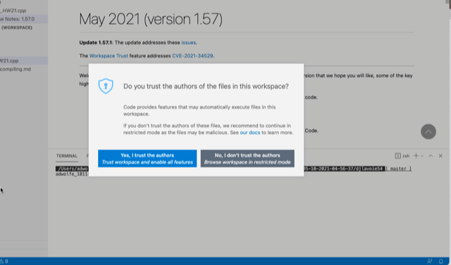

## Template Repository for COSC A211 - Fall 2021, Professor Wolfe sections

This file, `README.md`, is a sort of introduction to this repository you are using.  

#### *What's a Repository?*

A "repository" is a special kind of file folder used by Git to track the history of file changes. You can see we have a few files and folders in this repository. As you use a repository, you will be adding new files and modifying others.

You get a repository when you "accept" a GitHub Classroom assignment.  When it does this, it copies a Master Fall 2021 template repository for each student when you "accept an assignment."

A repository doesn't only track changes in one location, but it can synchronize changes among multiple copies ("clones") on multiple computers. You (and others) can make changes on the different repositories, and if there are conflicting changes, it will help you resolve them.

#### *Using this Repository on Your Computer*

To get this repository on your computer and use it like a regular computer folder, you will *clone* it from GitHub . In this course, we show you to use GitHub Desktop to clone your repository. (There are several correct ways to do this.) Once you've cloned it, just use it as normal.

An important part of this repository is `_Launchthis.code-workspace`, which we created for you to use Visual Studio Code more easily and efficiently. One way you can open Visual Studio Code is to double-click this file on your computer.

Visual Studio Code may give you a warning about this workspace. Click "Yes, I trust..."

